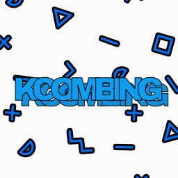
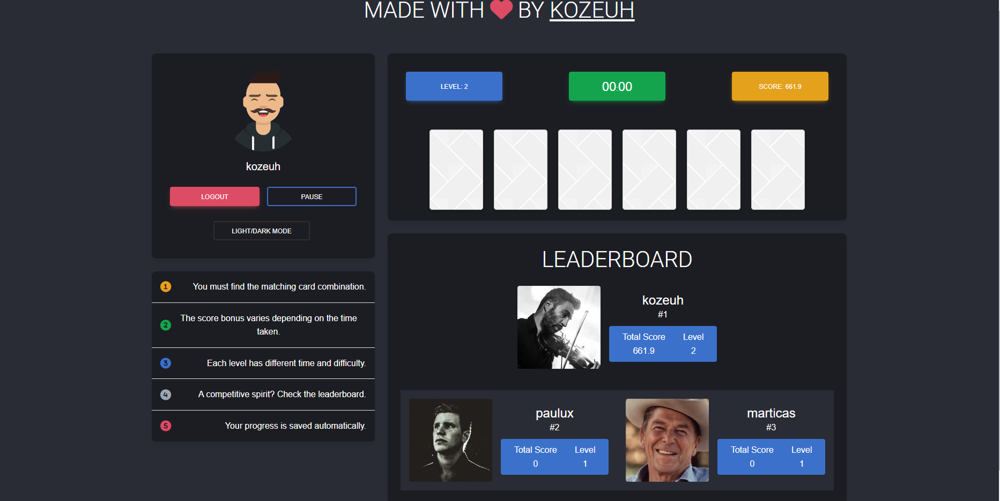
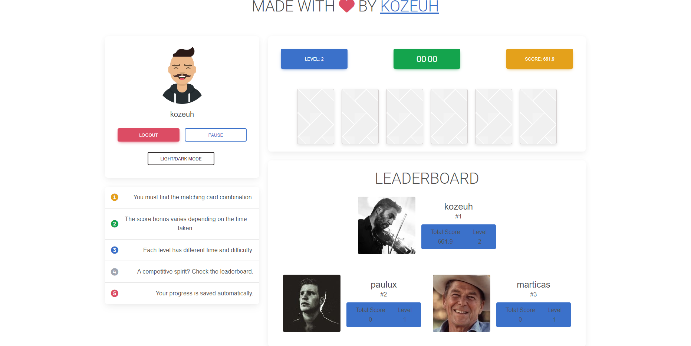

<h1 align="center"> kCombinGame </h1>  

  

  Card combination game. Built with TypeScript, Bootstrap 5.3, MongoDB & NodeJS.

  

  

<!-- START doctoc generated TOC please keep comment here to allow auto update -->
<!-- DON'T EDIT THIS SECTION, INSTEAD RE-RUN doctoc TO UPDATE -->
## Table of Contents

- [Introduction](#introduction)
- [Previews](#previews)
- [Features](#features)
- [Feedback](#feedback)
- [Contributors](#contributors)
- [Dependencies](#dependencies)
- [Build Process](#build-process)

<!-- END doctoc generated TOC please keep comment here to allow auto update -->

## Introduction

## Previews

  
<strong>➡️ View</strong>

   
  
  
   

## Features

A few of the things you can do with kCombinGame :

### Website 🌐

* Authentication required to play (nickname only)
* Choice of theme (dark/light) saved in memory.
* Ranking of the 3 best players.
* Bonus points vary according to the time required to complete a level.

## Feedback

Feel free to send us feedback -> [file an issue](https://github.com/KoZeuh/kCombinGame/issues/new). Feature requests are always welcome. If you wish to contribute, please take a quick look at the [guidelines](./CONTRIBUTING.md)!

## Contributors

[@KoZeuh](https://github.com/KoZeuh)

# Dependencies

- MongoDB (7.x)
- NodeJS (v20.9.x)

## Build Process

- Clone or download the repo.
- In a terminal at the root of the project, do `cd frontend` and `npm update` or `yarn update` to install the frontend dependencies.
- `npm run watch` or `yarn run watch` for the user interface in development mode in the `frontend` folder.
- `npm run build` or `yarn run build` for the user interface in prod mode in the `frontend` folder.

- In a terminal at the root of the project, do `cd backend` and `npm update` or `yarn update` to install the backend dependencies.
- Database connection and HTTP server configuration are in `backend/src/server.ts`.
- `npm run dev` or `yarn run dev` for development mode in the `backend` folder.
- `npm run start` or `yarn run start` for prod mode in the `backend` folder.

----------------------------------------------------------------------------------------------------------------------------------------------------------------------------------------------------------------------------------------------------------

